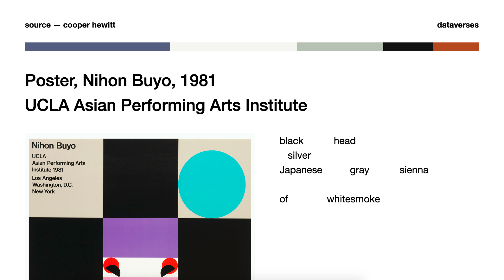

# cooper-hewitt-design
**dataverses** is a Python web application that creates fun, nonsensical poems with scraped data from Cooper Hewitt's graphic design catalogue.<br />
Inspired by Gertrude Stein's Yet Dish.

## Built With
* [Flask](https://flask-doc.readthedocs.io/en/latest/)
* [spaCy](https://spacy.io/)
* [scikit-learn](https://scikit-learn.org/stable/)
* [numPy](https://numpy.org/)
* [opencv-python](https://pypi.org/project/opencv-python/)
* [Cooper Hewitt's API](https://collection.cooperhewitt.org/api/)

## Getting Started
### Prerequisites
* Python 3.x
### Installation
1. Get your own access token from [Cooper Hewitt's API](https://collection.cooperhewitt.org/api/)
2. Add `.env` file to root and paste access token as a string like below<br />
``` 
ACCESS_TOKEN = <your access token>
```
3. Install python modules<br />
```
pip3 install -r requirements.txt
```
### Usage
* Run as Flask web application<br />
```
python3 app.py
```
* Run as results only in terminal (no picture)<br />
```
python3 hewitt_images.py
```

## Demo


## Acknowledgements 
* [Dominant colors in an image using k-means clustering](https://buzzrobot.com/dominant-colors-in-an-image-using-k-means-clustering-3c7af4622036)
* [Color Identification in Images](https://towardsdatascience.com/color-identification-in-images-machine-learning-application-b26e770c4c71)
* [Cooper Hewitt's Graphic Design catalogue](https://collection.cooperhewitt.org/tags/graphic-design)
* [Gertrude Stein's Yet Dish](https://www.poetryfoundation.org/poems/47838/yet-dish)
* [RapidTables RGB Color Chart](https://www.rapidtables.com/web/color/RGB_Color.html)