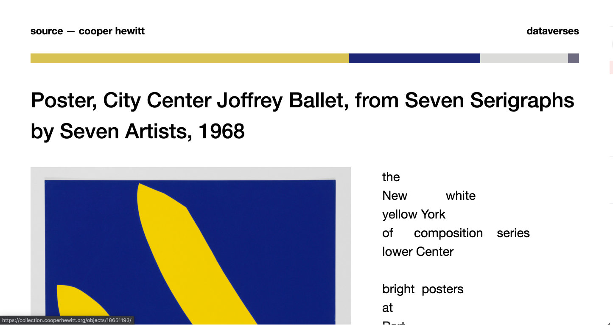

# cooper-hewitt-design
**dataverses** is a Python web application that creates fun, nonsensical poems with scraped data from Cooper Hewitt's graphic design catalogue.
Inspired by Gertrude Stein's Yet Dish.

## Live Demo
In progress :)

## Built With
* [Flask](https://flask-doc.readthedocs.io/en/latest/)
* [spaCy](https://spacy.io/)
* [scikit-learn](https://scikit-learn.org/stable/)
* [numPy](https://numpy.org/)
* [opencv-python](https://pypi.org/project/opencv-python/)

## Getting Started
### Prerequisites
* Python 3.x
### Installation
1. Get your own access token from [Cooper Hewitt](https://www.cooperhewitt.org/)
2. Add `.env` file to root and paste access token as a string like below
``` ACCESS_TOKEN = <your access token>```
3. Install python modules
```pip3 install -r requirements.txt```
### Usage
4. Run Flask web application
```python3 app.py```
5. Run results only in terminal (no picture)
```python3 hewitt_images.py```

## Demos



## Acknowledgements 
* [Dominant colors in an image using k-means clustering](https://buzzrobot.com/dominant-colors-in-an-image-using-k-means-clustering-3c7af4622036)
* [Color Identification in Images](https://towardsdatascience.com/color-identification-in-images-machine-learning-application-b26e770c4c71)
* [Gertrude Stein's Yet Dish](https://www.poetryfoundation.org/poems/47838/yet-dish)
* [RapidTables RGB Color Chart](https://www.rapidtables.com/web/color/RGB_Color.html)